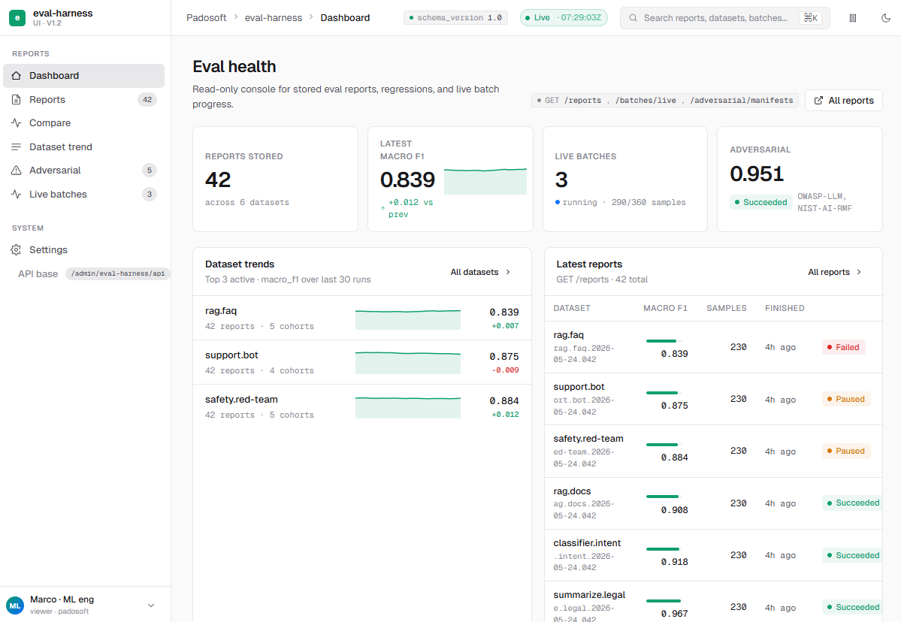
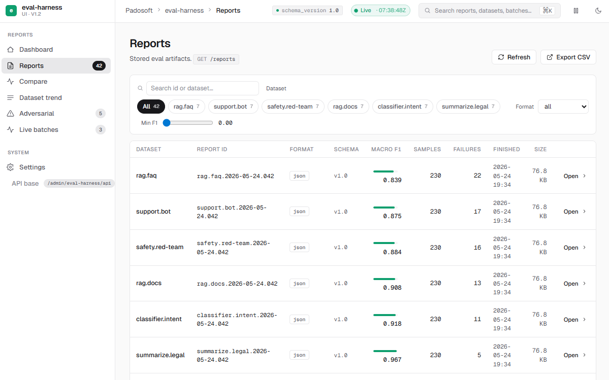
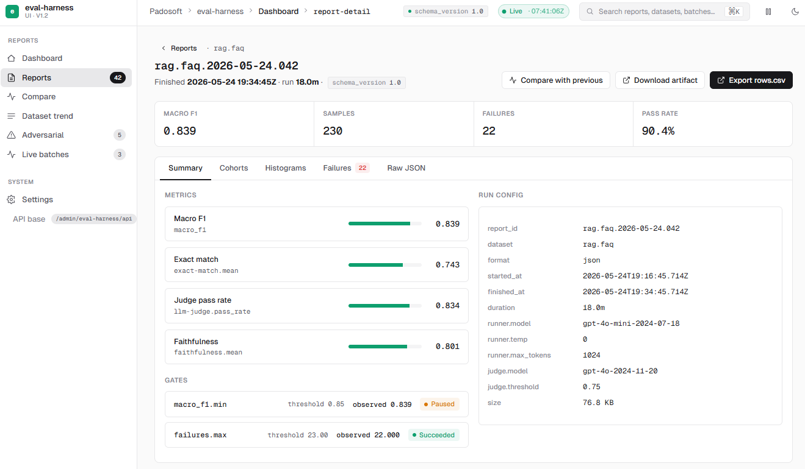
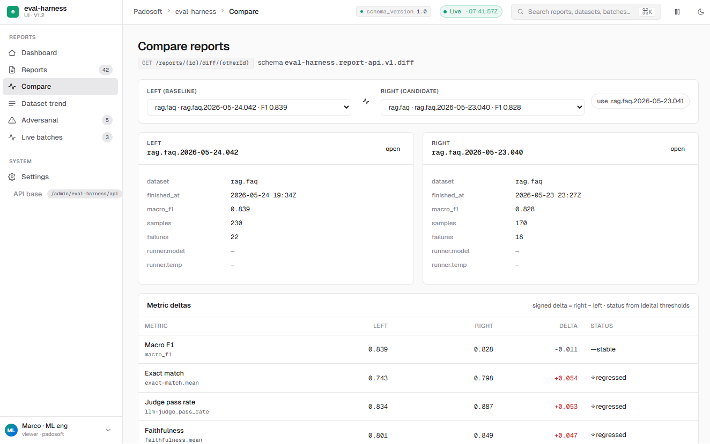
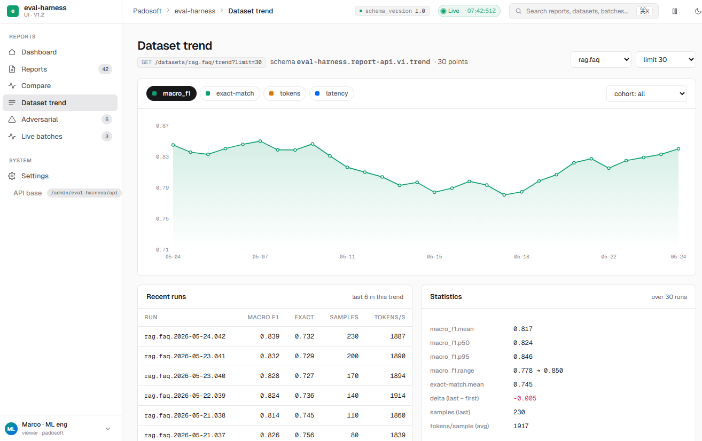
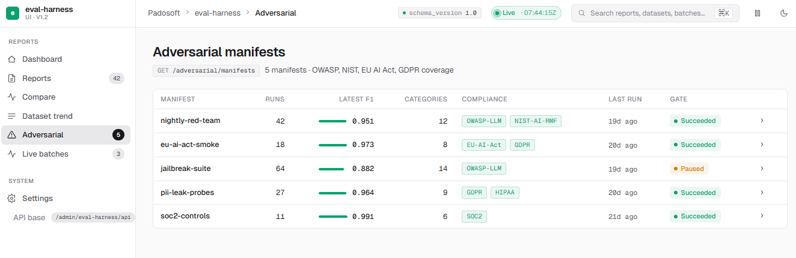
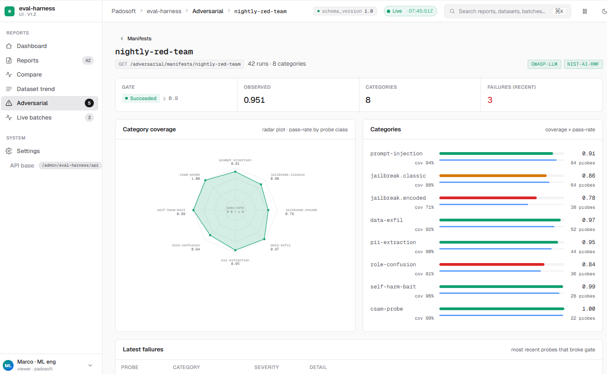
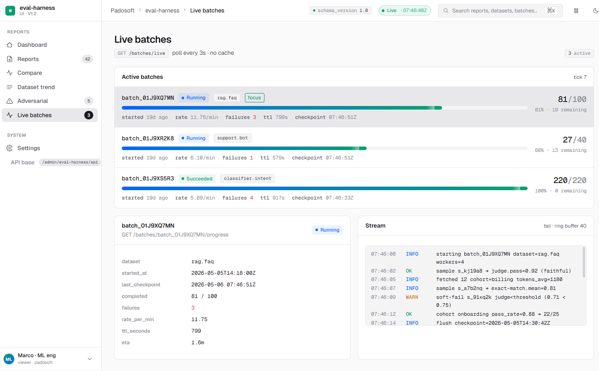

# Eval Harness UI Admin

**Package:** `padosoft/eval-harness-ui`  
**Target stack:** Laravel 13.x + PHP 8.3+  
**Purpose:** Read-only admin panel for consuming `padosoft/eval-harness` report APIs.

`eval-harness-ui` is a host-driven SPA package that gives QA teams and ops teams a ready dashboard without touching the `eval-harness` backend repository.

Backend API repository: [padosoft/eval-harness](https://github.com/padosoft/eval-harness)

## Table of contents

- [What this package gives you](#what-this-package-gives-you)
- [Screen list](#screen-list)
- [Why this package exists](#why-this-package-exists)
- [Architecture in plain words](#architecture-in-plain-words)
- [Runtime contract](#runtime-contract)
- [Production install (beginner-proof, copy/paste)](#production-install-beginner-proof-copy-paste)
- [Minimal security wiring](#minimal-security-wiring)
- [Environment and config reference](#environment-and-config-reference)
- [API mapping the UI expects](#api-mapping-the-ui-expects)
- [Local development setup](#local-development-setup)
- [Release process (what is expected in PR flow)](#release-process-what-is-expected-in-pr-flow)
- [Constraints and behavior notes](#constraints-and-behavior-notes)
- [Roadmap (current status aligned with AGENTS docs)](#roadmap-current-status-aligned-with-agents-docs)
- [Contributing and support](#contributing-and-support)
- [License](#license)

## What this package gives you

- 8 operational screens shipped as a SPA
- Fast route-based admin integration in the host app
- Clear errors for `404`, `422`, `503` response cases
- English/Italian translations
- Accessibility checks integrated in CI (`serious` and `critical` gates)
- Playwright e2e coverage for all major flows
- Zero API mutations: **read-only by design**

### Screen list

- Dashboard  
  
- Reports list  
  
- Report detail  
  
- Compare  
  
- Trend  
  
- Adversarial manifests  
  
- Adversarial manifest details  
  
- Live batches  
  
- Online monitoring — production pass-rate-over-time chart with a drift
  alert band, consuming `GET /<prefix>/online/{dataset}/trend`
  (requires `padosoft/eval-harness` `^1.3.0`).

## Why this package exists

`eval-harness` can keep domain logic and API concerns.
This package adds only UI surfaces and route mounting for admin consumption.

- No internal `eval-harness` storage or processing code is copied into this package.
- No destructive/POST/PUT/PATCH/DELETE calls are part of this UI flow.
- Host app owns auth, tenancy, and policy decisions.

## Architecture in plain words

```
Host Laravel app
  -> Laravel Service Provider
     -> package config is published
     -> route path is mounted under a configurable prefix
        -> Blade entrypoint + JSON bootstrap payload
           -> Vite-powered React SPA (TypeScript)
```

## Runtime contract

- `EVAL_HARNESS_UI_PREFIX` defines where the panel is mounted. Default: `admin/eval-harness`.
- `EVAL_HARNESS_API_BASE` defines the host base path for report APIs. Default: `/admin/eval-harness/api`.
- Optional tenant header is sent when needed: `X-Eval-Harness-Tenant`.
- Frontend reads bootstrap info (version/labels/version contract hints) from package endpoints.

## Production install (beginner-proof, copy/paste)

### 1) Install the package

```bash
composer require padosoft/eval-harness-ui
```

### 2) Publish package files

```bash
php artisan vendor:publish --tag=eval-harness-ui-config
php artisan vendor:publish --tag=eval-harness-ui-assets
php artisan vendor:publish --tag=eval-harness-ui-views
```

### 3) Configure environment

Add to your `.env`:

```env
EVAL_HARNESS_UI_ENABLED=true
EVAL_HARNESS_UI_PREFIX=admin/eval-harness
EVAL_HARNESS_UI_MIDDLEWARE="web,auth,can:eval-harness.viewer"
EVAL_HARNESS_API_BASE=/admin/eval-harness/api
EVAL_HARNESS_TENANT_HEADER=X-Eval-Harness-Tenant
EVAL_HARNESS_UI_LOCALE=en
```

### 4) Clear caches and test route exposure

```bash
php artisan config:clear
php artisan route:clear
php artisan optimize:clear
php artisan route:list --path=admin/eval-harness
```

### 5) Open the UI

Navigate to `http://your-app.test/admin/eval-harness`.
If login is required, use a user that can pass `eval-harness.viewer` policy.

## Minimal security wiring

This package does not define authorization policy defaults.
You must define who can access these routes in your host app.

### Example Gate setup

```php
use Illuminate\Support\Facades\Gate;

Gate::define('eval-harness.viewer', function ($user) {
    return $user->can('viewEvalHarness');
});
```

If you are not using policies, replace this with any `Closure` logic that matches your project auth model.

## Environment and config reference

```php
// config/eval-harness-ui.php (defaults)
return [
    'enabled' => env('EVAL_HARNESS_UI_ENABLED', false),
    'route_middleware' => ['web', 'auth', 'can:eval-harness.viewer'],
    'prefix' => env('EVAL_HARNESS_UI_PREFIX', 'admin/eval-harness'),
    'api_base' => env('EVAL_HARNESS_API_BASE', '/admin/eval-harness/api'),
    'tenant_header' => env('EVAL_HARNESS_TENANT_HEADER', 'X-Eval-Harness-Tenant'),
    'locale' => env('EVAL_HARNESS_UI_LOCALE', env('APP_LOCALE', 'en')),
    'schema_version' => [
        'required' => true,
        'min_supported' => '1.0',
    ],
    'metric_labels' => [
        'exact-match.mean' => 'Exact match',
        'llm-judge.pass_rate' => 'Judge pass rate',
        'macro_f1' => 'Macro F1',
    ],
];
```

## API mapping the UI expects

| Screen | Endpoint(s) |
|---|---|
| Dashboard | `/reports`, `/batches/live`, `/adversarial/manifests`, `/datasets/{name}/trend?limit=30` |
| Reports list | `/reports` |
| Report detail | `/reports/{id}`, `/reports/{id}/cohorts`, `/reports/{id}/histograms`, `/reports/{id}/rows.csv`, `/reports/{id}/download` |
| Compare | `/reports/{id}/diff/{otherId}` |
| Trend | `/datasets/{name}/trend` |
| Adversarial | `/adversarial/manifests`, `/adversarial/manifests/{name}` |
| Live batches | `/batches/live`, `/batches/{id}/progress` |

## Local development setup

### Requirements

- PHP 8.3+ (`8.4` recommended for CI parity)
- Node.js 20+ (LTS)
- Composer and npm
- Laravel 13.x app shell

### Install dependencies and run checks

```bash
composer install
npm install

npm run typecheck
npm run test:unit
npm run build
npm run e2e
npm run e2e:accessibility

composer validate --strict --no-check-publish
composer analyse
composer test
```

If all commands are green, your local environment matches the repository quality gates.

### Project structure (quick map)

- `src/`: package service provider and route registration.
- `config/`: package config defaults.
- `routes/web.php`: mount entrypoint for the admin panel.
- `resources/js/`: React application source.
- `resources/views/`: Blade bootstrap template.
- `tests/Feature` and `tests/Unit`: backend regression tests.
- `tests/e2e`: Playwright and accessibility test suites.
- `docs/`: roadmap, progress and operating rules.
- `.github/`: workflows and PR policy docs.

## Release process (what is expected in PR flow)

1. Implementa in branch `task/<macro>-...`.
2. Apri PR per quel subtask.
3. Esegui local gates e richiedi Copilot review.
4. Merga nel macro branch dopo review e test pass.
5. Merga in `main` solo con CI verde e checklist completata.
6. Tagga e push per rilascio automatico.

```bash
git checkout main
git pull --ff-only
git tag -a v0.x.y -m "Release v0.x.y"
git push origin v0.x.y
```

`release.yml` in `.github/workflows` can create the GitHub release automatically if configured.

## Constraints and behavior notes

- No mutation endpoints are required by this package.
- Schema compatibility is enforced when `schema_version` is expected and missing data is treated as legacy/empty state.
- Large trend datasets may be rate-limited by host-side API limits and can return `503`.

## Roadmap (current status aligned with AGENTS docs)

- v0.1.0 completed with dashboard, reports, compare, trend, adversarial, and live batches.
- v0.2.0 planned for future release: chart unification and export reporting improvements.
- v0.3.0 planned for future release: runtime i18n switching and policy cache improvements.
- v0.4.0 planned for future release: richer release notes and host extension points.

## Contributing and support

If you are joining as a junior contributor:
1. Read `docs/PROGRESS.md` and `docs/PLAN.md` before touching code.
2. Follow the required tests before opening a PR.
3. Keep modifications small and scoped.
4. Respect hard anti-zombie server rules when running local checks (no dangling PHP/Vite/Node processes).

## License

MIT
